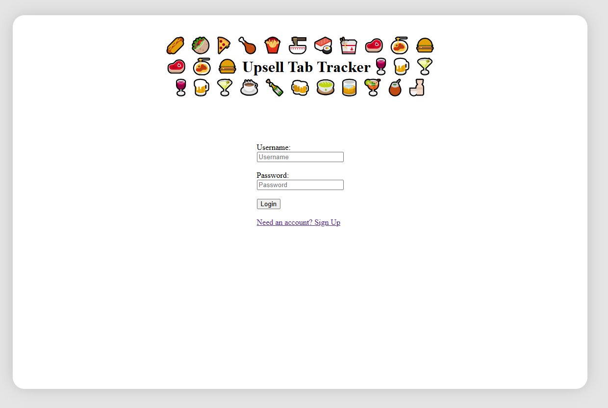
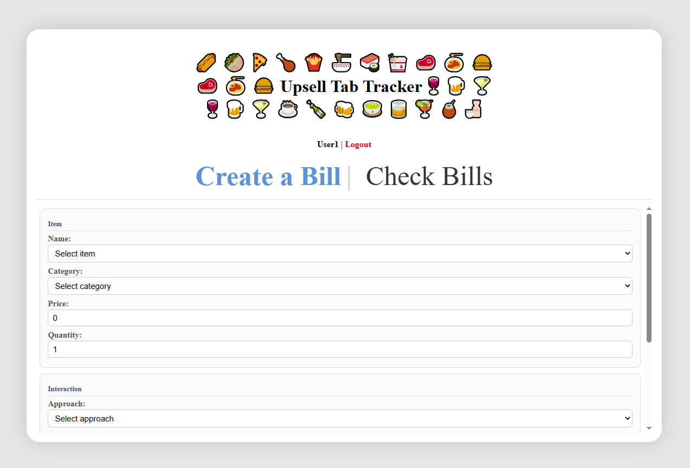
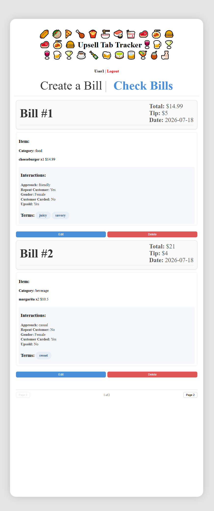

# upsell-tracking-and-performance-analytics-system

## Description

Upsell Tab Tracker is a full-stack app for bartenders and servers to log bills and track which sales approaches and upsell terms actually work. Users log in, create a bill with an item and how they interacted with the customer or servers approach used, gender, upsell, feedback, and more, along with terms describing the sale, and can view, edit, or delete their past bills.

## Technologies Used

- **Backend:** Flask, Flask-RESTful, Flask-SQLAlchemy, Flask-Migrate, Flask-Bcrypt, Flask-CORS
- **Database:** SQLite (SQLAlchemy ORM)
- **Frontend:** React, React Router, Context API
- **Other:** SQLAlchemy-Serializer for JSON serialization, bcrypt for password hashing

## Setup / Run Instructions

### Backend

```bash
cd server
pipenv install
pipenv shell
python seed.py
python app.py
```

Backend runs on `http://localhost:5556`

### Frontend

In a new terminal:

```bash
cd client
npm install
npm run dev
```

Frontend runs on `http://localhost:5173`

You'll need both running at the same time.

## Core Functionality

- Sign up / log in / log out (session-based auth with bcrypt password hashing)
- Users can only see and edit their own bills
- Create a bill: item, interaction details (approach, gender, upsell, carded, repeat, feedback), and one or more terms
- View bills with pagination (2 per page)
- Edit an existing bill (tip, item details, terms)
- Delete a bill
- Error handling and validation on both frontend and backend

## Models / Relationships

```
User -> Bill -> Item -> Interaction -> Term
```

## Routes

| Method | Route | Description |
|--------|-------|-------------|
| POST | /signup | Create a new user |
| POST | /login | Log in |
| DELETE | /logout | Log out |
| GET | /check_session | Check if logged in |
| GET | /bills | Get logged-in user's bills (paginated) |
| POST | /bills | Create a new bill |
| GET | /bills/:id | Get one bill |
| PATCH | /bills/:id | Update a bill |
| DELETE | /bills/:id | Delete a bill |

## Screenshots

### Login


### Create a Bill


### Check Bills


## Created By
Christopher Perez
